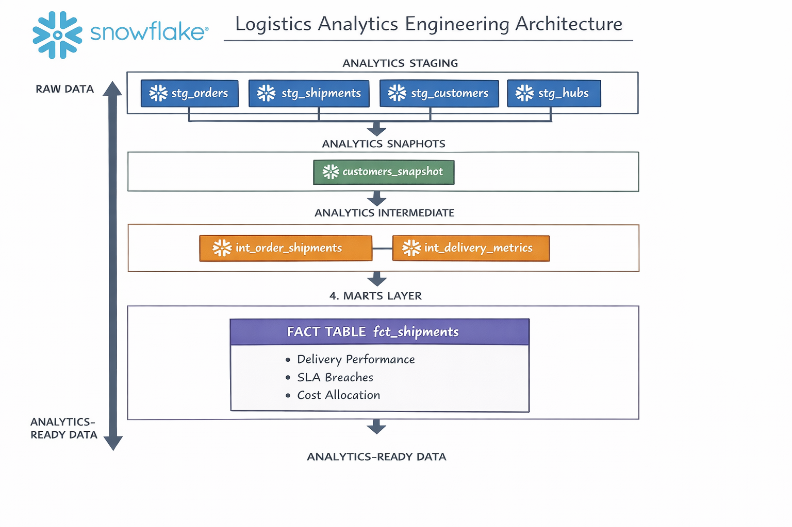

# Logistics Analytics Engineering Project

## Overview

This project is an **end-to-end analytics engineering system** built using **Snowflake** and **dbt** to analyze logistics operations.

It transforms raw operational data into a **shipment-level analytics fact table** that enables reliable analysis of:

- Delivery performance  
- SLA breaches  
- Hub-level operating cost allocation  

The project follows **modern analytics engineering best practices**, including layered modeling, data quality enforcement, historical tracking via snapshots, and full documentation with dbt docs.

---

## Business Problem

A logistics company wants to answer key operational questions such as:

- How many shipments are delivered late?
- Which shipments breached delivery SLAs?
- How large are delivery delays?
- How should hub operating costs be allocated to shipments?

While raw data exists, it is:
- Inconsistent
- Difficult to analyze directly
- Lacking historical context

This project builds a **trustworthy analytics layer** that converts raw logistics data into decision-ready metrics.

---

## Tech Stack

- **Data Warehouse**: Snowflake  
- **Transformation Tool**: dbt  
- **Modeling Paradigm**: Analytics Engineering  
- **Documentation**: dbt docs  

---

## Project Architecture




---

## Modeling Layers Explained

### 1. Staging Layer (`analytics_staging`)

**Purpose**  
Clean and standardize raw source data while preserving original grain.

**Key principles**
- No joins  
- No business logic  
- Strict data contracts enforced via tests  
- Type normalization and naming consistency  

This layer acts as a **trusted foundation** for downstream models.

---

### 2. Snapshots (`analytics_snapshots`)

**Purpose**  
Preserve historical truth for slowly changing attributes.

**Example**
- Customer loyalty status may change over time

Snapshots ensure:
- History is not overwritten  
- Downstream metrics remain historically accurate  

Implemented using dbt’s **check strategy**.

---

### 3. Intermediate Layer (`analytics_intermediate`)

**Purpose**  
Centralize reusable business logic while maintaining strict grain control.

#### `int_order_shipments`
- Shipment-grain dataset enriched with order context  
- Establishes the core relationship between shipments and orders  

#### `int_delivery_metrics`
- Computes shipment performance metrics:
  - `actual_delivery_days`
  - `delivery_delay_days`
  - `is_sla_breached`
- Explicitly handles in-transit shipments (`NULL ≠ false`)

Business logic is written **once** and reused downstream.

---

### 4. Marts Layer (`analytics_marts`)

#### Fact Table: `fct_shipments`

**Grain**  
One row per shipment

**Key metrics**
- Delivery delay  
- SLA breach indicator  
- Allocated hub operating cost per shipment  

**Cost allocation logic**
- Monthly hub operating costs  
- Evenly distributed across shipments per hub per month  
- Implemented using window functions for transparency and explainability  

This table is designed to be:
- Dashboard-friendly  
- Easy to query  
- Trustworthy for analytics and decision-making  

---

## Data Quality & Testing

- Column-level tests in staging and marts  
- Grain enforcement on fact tables  
- Business-critical assumptions validated early  
- Data issues surfaced upstream rather than hidden downstream  

---

## Documentation & Lineage

The project is fully documented using **dbt docs**, providing:

- Model-level descriptions  
- Column-level documentation  
- End-to-end lineage visualization  

To view docs locally:

```bash
dbt docs generate
dbt docs serve
